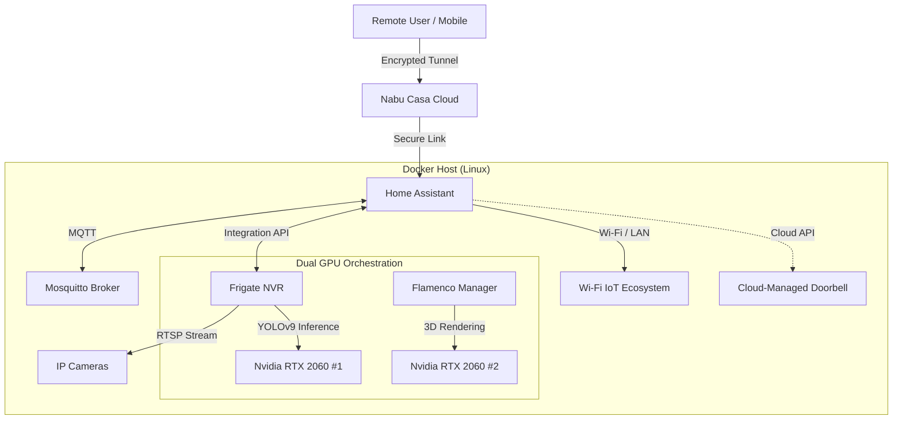

# Home Lab Infrastructure & Automation

## Project Overview
This repository documents the configuration and infrastructure of a self-hosted home laboratory environment. The primary goal of this project is to maintain a robust, 24/7 automated ecosystem for home security, media management, and IoT device orchestration.

The system runs on a Linux-based server utilizing **Docker** for containerization, ensuring distinct separation of services and ease of backup/restoration.

## Architecture
The system is designed with a service-oriented architecture, using a reverse proxy to manage secure external access to internal services.

## Tech Stack
* **OS:** Linux (Ubuntu Server)
* **Containerization:** Docker (Multiple Compose Stacks)
* **Automation:** Home Assistant (HASS)
* **AI & Vision:** Frigate NVR (YOLOv9-s-320 Model)
* **3D Rendering:** Flamenco (Blender Render Farm)
* **Hardware:** **Dual Nvidia RTX 2060s** (Parallel Configuration)
* * **Remote Access:** Nabu Casa (Home Assistant Cloud)

## Key Components

### 1. Home Assistant (Automation Hub)
The central nervous system that unifies disparate IoT ecosystems.
* **Integrations:** Aggregates **Wi-Fi based IoT endpoints** and **Cloud-Managed devices** into a single local control plane, removing dependence on proprietary vendor apps.
* **Automations:** Complex logic flows based on presence detection, time of day, and environmental sensors.
* **Dashboard:** Custom YAML-configured dashboards for mobile and tablet control.

### 2. Frigate NVR (AI Security)
A local NVR solution utilizing the **YOLOv9-s-320** model for high-accuracy object detection.
* **Hardware Acceleration:** Leverages the **Nvidia RTX 2060** via TensorRT/ONNX for real-time inference, significantly reducing CPU load compared to standard CPU decoding.
* **Integration:** Feeds real-time binary sensor data (e.g., "Person Detected") into Home Assistant.

### 3. Flamenco (3D Render Farm)
Self-hosted rendering manager for Blender projects.
* **Architecture:** Dedicated hardware assignment utilizing the secondary GPU (**RTX 2060 #1**) to ensure rendering tasks do not impact NVR object detection performance on the primary card.

### 4. Networking & Maintenance
* **Remote Access:** Utilizes **Nabu Casa** for secure, end-to-end encrypted remote access, eliminating the need for open ports or complex firewall rules.
* **Backup Strategy:** Automated snapshots of configuration directories to external storage.

---
*Note: Sensitive configuration files (secrets.yaml, .env) are excluded from this repository for security purposes.*
